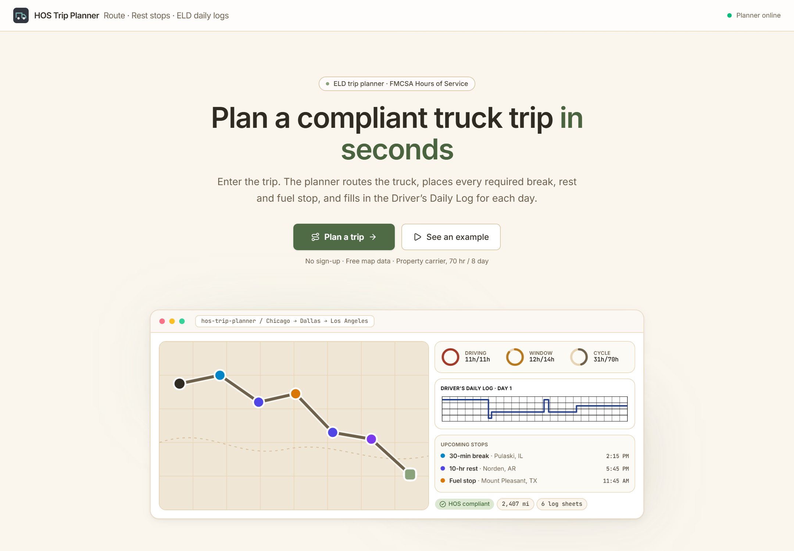
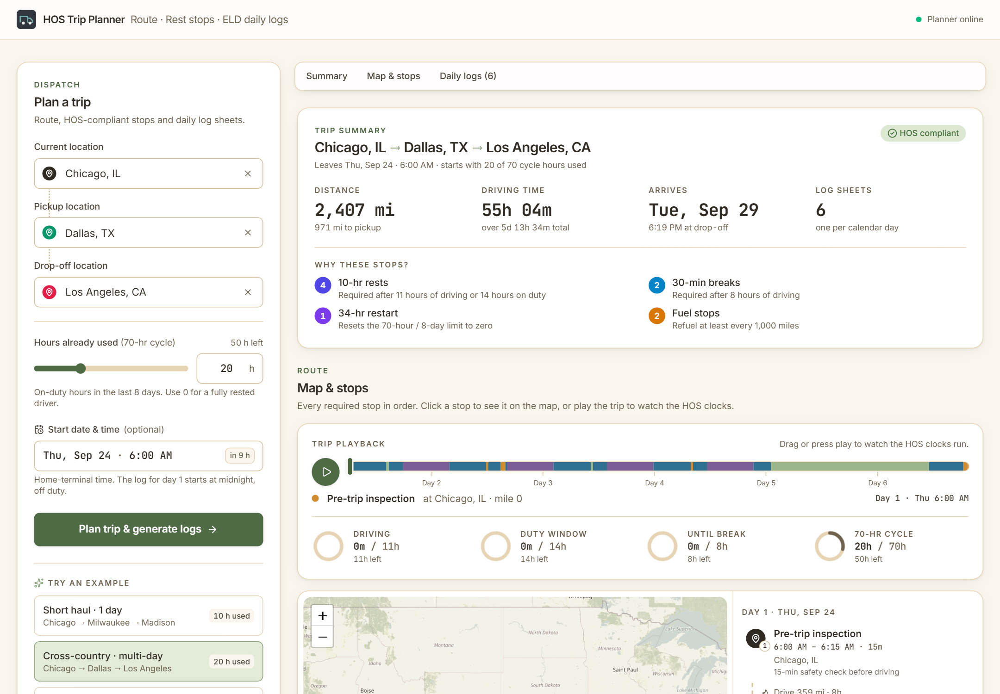
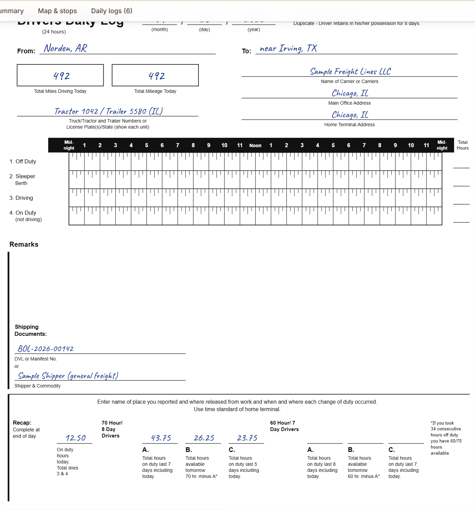
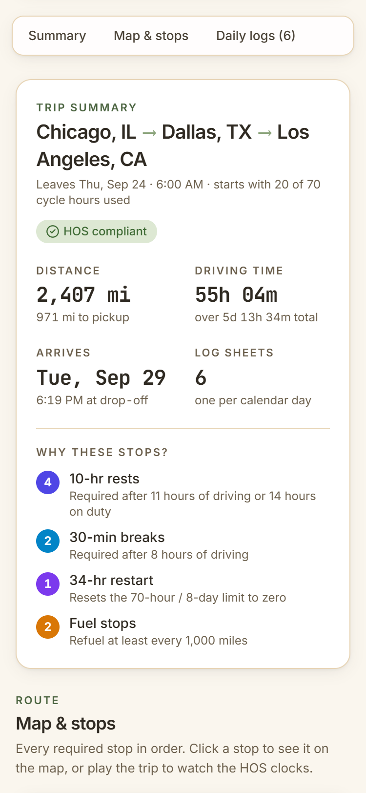
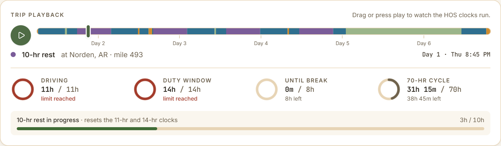
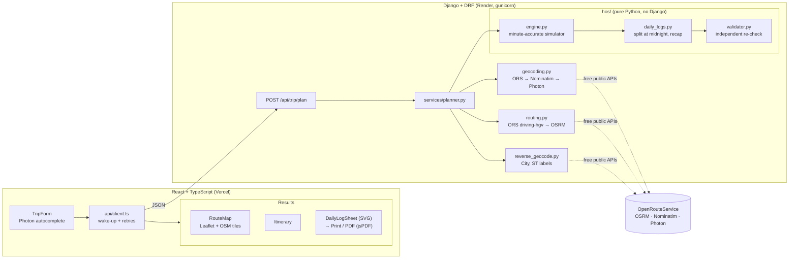

# HOS Trip Planner

Enter a truck trip (current location, pickup, drop-off and the hours already used in the 70-hour
cycle). You get back:

1. **A route map** with every required stop placed on it: fuel, 30-minute breaks, 10-hour rests
   and 34-hour restarts.
2. **Filled-in Driver's Daily Log sheets**, one per calendar day. Each is drawn to match the paper
   form, and all of them can be printed or downloaded as a PDF.

The schedule follows FMCSA Hours of Service for a property-carrying driver (49 CFR Part 395,
70 hours / 8 days). An independent validator re-checks every plan and marks each sheet
**✓ HOS compliant**.

**Live app:** `https://<your-app>.vercel.app` · **API:** `https://<your-api>.onrender.com/api/health`



<sub>Screenshots show the Day (light) theme.</sub>

| Desktop | Daily log sheet | Mobile |
|---|---|---|
|  |  |  |

## Highlights

- **A three-screen flow.** The app opens on a dashboard that explains what it does and how, with
  an animated preview (a route drawing itself, gauges filling, a log line being traced). The
  **Plan a trip** button brings the trip form to the center of the screen on its own. After
  planning, the results appear with the form alongside for quick changes. Each screen has its
  own URL (`#plan`, `#results`), so the browser's Back button works, and the logo returns to the
  dashboard. **See an example** runs the cross-country trip in one click.
- **Trip playback with live HOS clocks.** Drag the scrubber, or press play, to move a truck along
  the route. Four gauges fill against the limits: 11-hr driving, 14-hr duty window, 8 hours until
  a break, and the 70-hr cycle. They turn amber near a limit and red at it, and a green bar shows
  each rest counting down until the clocks reset. A cursor follows along on that day's log sheet.
  The scrubber track doubles as a status strip for the whole trip, colored by duty status
  (driving, on duty, sleeper berth, off duty).
- **Log sheets that draw themselves.** The duty line is traced like a pen stroke, then the totals,
  the "=24" and the remarks are written in one by one. Print and PDF copies are always fully drawn.
- **"Why these stops?"** Each rest, break and fuel stop is shown with the rule that required it,
  e.g. "11-hr driving limit reached".
- **Night Haul theme, with a Day toggle.** The default look is a truck cab at night, in the
  Color Hunt palette `#222831 · #31363F · #76ABAE · #EEEEEE`: charcoal and slate panels, glowing
  teal HOS gauges and buttons, and a dark navigation-style map. The Day theme uses
  `#A0937D · #E7D4B5 · #F6E6CB · #B6C7AA` on a soft ivory page: beige lines, deep sage buttons, taupe details. Miles,
  hours and times use JetBrains Mono, like an instrument readout. The **Day / Night** button in
  the header switches to a light theme and remembers the choice. Log sheets are always white
  paper, and printing is always light.
- **A calm map.** OpenStreetMap tiles are desaturated so the route and stops stand out, and a
  dash flows along the loaded leg to show the direction of travel.
- All animations switch off for users who prefer reduced motion.



## Try it

Click one of the **Try an example** presets:

| Preset | Trip | What it shows |
|---|---|---|
| Short haul | Chicago → Milwaukee → Madison, 10 h used | Single day; no rest needed |
| Cross-country | Chicago → Dallas → Los Angeles, 20 h used | Several log days, fuel stops, 30-min breaks and 10-hr rests. With the ORS truck profile (~44 mph) the trip takes 6 days and triggers a 34-hr restart; with the car-speed fallback it takes 4 days |
| Near cycle limit | Atlanta → Nashville → Denver, 62 h used | 34-hr restart early in the trip |

## Architecture



```
backend/     Django API: hos/ engine (pure Python), trips/ HTTP + geo services, tests/
frontend/    Vite + React + TS + Tailwind: form, map, itinerary, SVG log sheets, PDF export
screenshots/ README images, Day theme (regenerate with frontend/scripts/readme-shots.mjs)
render.yaml  Render blueprint for the API
```

## How the HOS engine works

`backend/hos/engine.py` simulates the trip in **whole minutes**. The phases are: pre-trip
inspection → drive to pickup → 1 h pickup → drive to drop-off → 1 h drop-off → post-trip
inspection. Driving is scheduled in chunks. Each chunk ends exactly where the first limit would
bind, so no chunk can cross a limit partway through:

```
chunk = min(leg remaining,
            11 h − driving this shift,        §395.3(a)(3)
            14-h window end − now,            §395.3(a)(2)
            8 h − driving since a 30-min gap, §395.3(a)(3)(ii)
            70 h − cycle used,                §395.3(b)
            minutes until 1,000 mi since fuel)
```

When a limit is reached, the engine picks the rest in priority order:

1. The 70-h cycle is used up → **34-h restart**, which resets the cycle (§395.3(c)).
2. 11 h driven or the 14-h window has closed → **10-h rest** in the sleeper berth.
3. 8 h driven since a 30-min gap → **30-min break**.
4. 1,000 mi since the last fuel stop → **30-min fuel stop**, logged On Duty.

Any 30+ consecutive minutes not driving (pickup, fuel, or a mix of statuses) also satisfies the
break. On-duty work after hour 14, or after the cycle is used up, is still allowed; only driving is
restricted, as the FMCSA guide explains.

Average speed for each leg comes from the routing API's own distance ÷ duration.

The events are then split at midnight into log days. Each day's four status totals always add up
to exactly **24.00**, using largest-remainder rounding. `validator.py` then rebuilds every clock
from the events alone and re-checks all the rules. The API returns that result, and the frontend
shows it on each sheet.

### Drawing the log sheet

`frontend/src/components/logs/DailyLogSheet.tsx` is a pure SVG copy of `blank-paper-log.png`:

- **Header:** date, From / To, both mileage boxes, carrier / office / terminal, and truck numbers.
  The carrier and vehicle details are editable, and fill every sheet.
- **Grid:** the black hour band, four rows with 15-minute ticks, and the totals column with
  **"=24"**.
- **Duty line:** one continuous pen-blue stroke that runs horizontally in the active row and
  vertically at each change, like the "Completed Grid" on p.18 of the guide.
- **Remarks:** a bracket under the grid for each stop and a diagonal "City, ST" label, as on
  pp.18–19. Labels are spaced apart so they never overlap.
- **Bottom:** shipping documents and the full recap block.

**Download PDF** turns each sheet into one Letter page. **Print** uses print CSS to put one sheet
on each page.

## Assumptions

1. **Driver:** property-carrying, 70 hr / 8 days. No adverse-driving or short-haul exceptions.
2. **Fresh start:** the driver has had 10+ consecutive hours off before the trip. Midnight until
   the start on day 1 is logged Off Duty. The trip starts at the next 6:00 AM unless a start is
   given.
3. **Prior cycle hours** ("Current Cycle Used") are treated as one block that does not roll off
   during the trip. This is conservative: a 34-hr restart may come earlier than strictly
   necessary, but never later.
4. **10-hr rests** are logged as Sleeper Berth. **Split sleeper-berth pairing (§395.1(g)) is not
   used.**
5. **30-min break:** Off Duty. A pickup, fuel stop, or any 30+ minutes not driving also counts.
6. **Fuel:** the truck starts with a full tank. A **30-min On Duty** fuel stop comes at or before
   every 1,000 mi. The driver also fuels during stops they're already making (break, rest,
   pickup) once 75% of that distance is used.
7. **Pickup / drop-off:** 1 h On Duty (not driving) each.
8. **Inspections:** a 15-min pre-trip at the start and a 15-min post-trip at the end, both On
   Duty. This can be turned off in the engine config.
9. **Speed:** from the routing API's own duration for each leg. With an ORS key this is the truck
   (HGV) profile; the fallback, OSRM, uses a car profile and is a little optimistic. Traffic,
   weather and meal breaks are not modeled.
10. **Time zone:** all times are home-terminal time (`HOME_TERMINAL_TZ`, default
    America/Chicago), as §395.8 requires. Crossing time zones does not shift the log, and DST
    changes during a trip are ignored.
11. **Remarks:** the nearest city, town or village as "City, ST", with "near" added when the
    point is more than 3 mi away. Highway and milepost are not available.
12. **Recap:** A = running 70-hr total, B = 70 − A, C = on-duty hours over the last 5 days of
    *this trip* (earlier days are not known). The 60-hr/7-day columns are left blank, since this
    is a 70-hr driver.
13. **Carrier and vehicle fields** are sample text the user can edit. They are saved in the
    browser only.

## Run locally

```bash
# API: http://127.0.0.1:8000
cd backend
python -m venv .venv && source .venv/bin/activate      # Windows: .venv\Scripts\activate
pip install -r requirements.txt
cp .env.example .env                                   # optional: ORS_API_KEY=<free key>
python manage.py runserver

# Web: http://localhost:5173
cd frontend
npm install
cp .env.example .env.local                             # VITE_API_URL=http://127.0.0.1:8000
npm run dev
```

## Tests and QA

```bash
cd backend && pytest                       # 612 tests: engine scenarios, 576 property cases, API
cd frontend && npm run build               # type-check + production build
cd frontend && node scripts/qa.mjs         # E2E in Chrome: all presets, 1440/768/375 px, PDF, errors
cd frontend && node scripts/a11y.mjs       # axe-core WCAG A/AA scan of the results screen
cd frontend && node scripts/a11y-form.mjs  # the same scan on the location dropdown and date picker, both themes
```

The backend tests check that every plan:

- never drives after hour 14;
- never drives more than 11 h in one window;
- never drives more than 8 h without a 30-min gap;
- never drives more than 1,000 mi without fuel;
- never drives past 70 h in the cycle;
- has every day totaling exactly 24.00.

They run across distances from 30 to 3,300 mi, cycle values from 0 to 70 h, and four different
start times.
